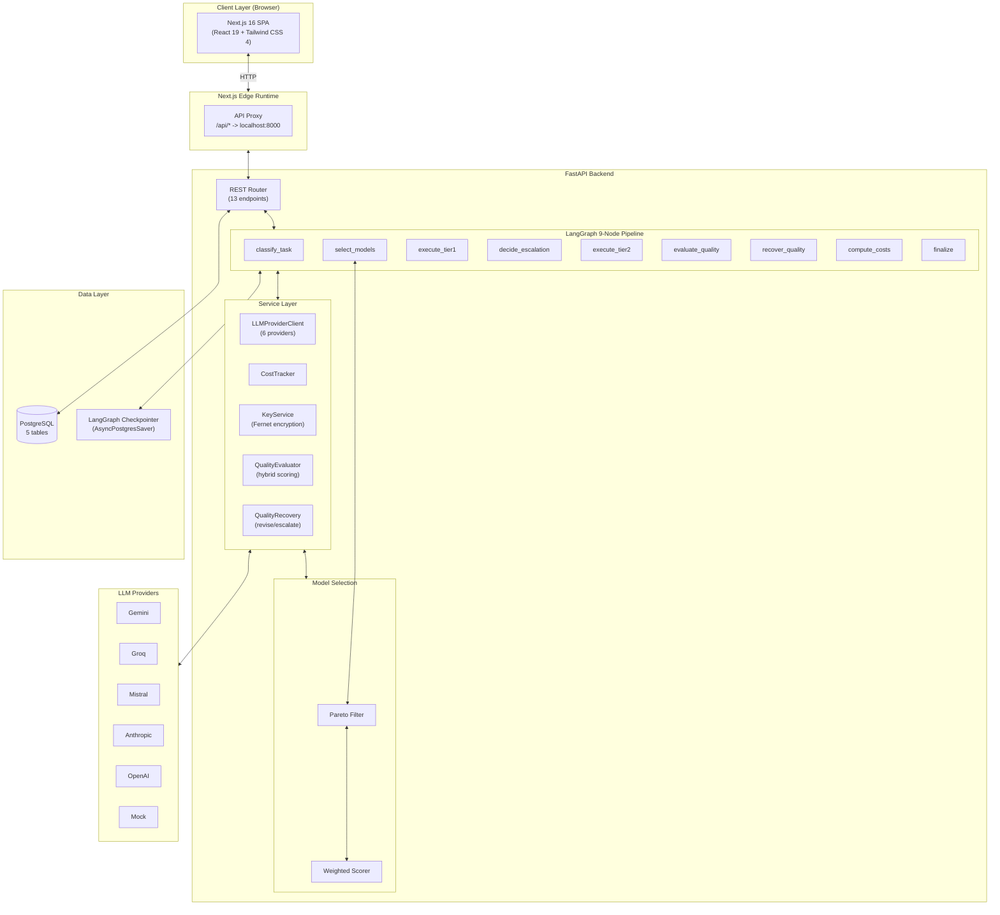
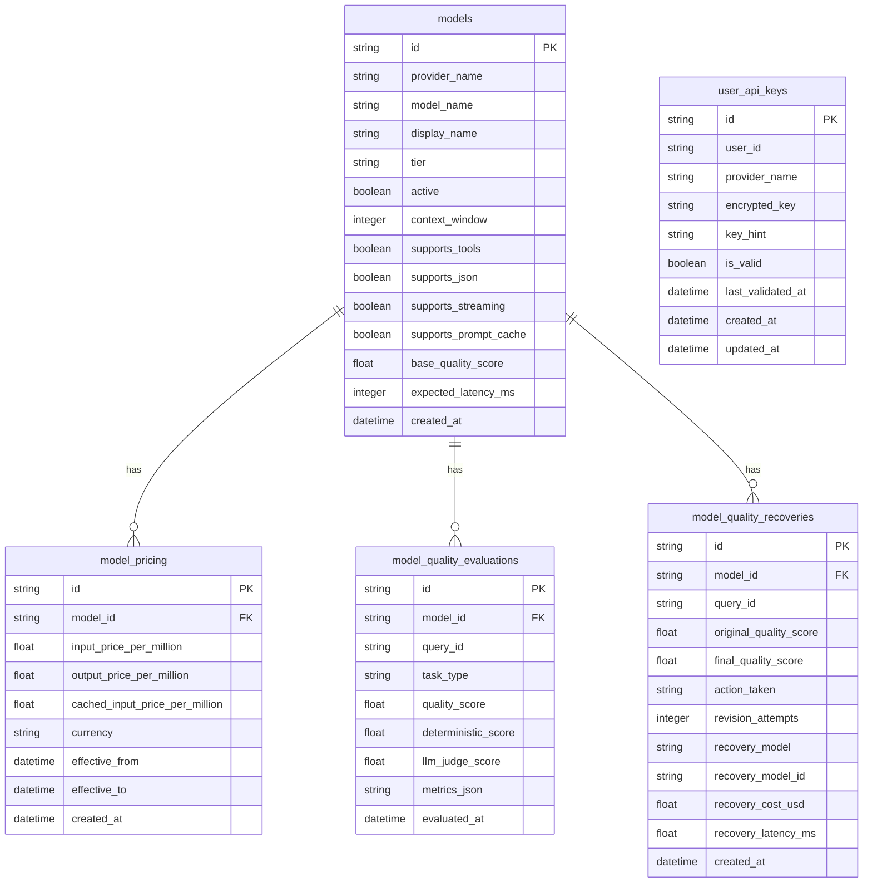

# System Architecture

Multi-tier topology, LangGraph pipeline, database schema, and cross-module dependency map for the Cost-Aware Cascading LLM Router.

---

## High-Level Architecture



---

## LangGraph Pipeline

The core orchestration engine is a `StateGraph` with 9 nodes wired as a linear pipeline with one conditional branch.

### Graph Definition

```python
# agent/graph.py
graph = StateGraph(RouterState)

graph.add_node("classify_task", classify_task)
graph.add_node("select_models", select_models)
graph.add_node("execute_tier1", execute_tier1)
graph.add_node("decide_escalation", decide_escalation)
graph.add_node("execute_tier2", execute_tier2)
graph.add_node("evaluate_quality", evaluate_quality)
graph.add_node("recover_quality", recover_quality)
graph.add_node("compute_costs", compute_costs)
graph.add_node("finalize", finalize)

graph.add_edge(START, "classify_task")
graph.add_edge("classify_task", "select_models")
graph.add_edge("select_models", "execute_tier1")
graph.add_edge("execute_tier1", "decide_escalation")

graph.add_conditional_edges(
    "decide_escalation",
    route_after_decision,
    {"escalate": "execute_tier2", "direct": "evaluate_quality"},
)

graph.add_edge("execute_tier2", "evaluate_quality")
graph.add_edge("evaluate_quality", "recover_quality")
graph.add_edge("recover_quality", "compute_costs")
graph.add_edge("compute_costs", "finalize")
graph.add_edge("finalize", END)
```

### Node Responsibilities

| Node | File | Input (from State) | Output (to State) | Purpose |
|---|---|---|---|---|
| `classify_task` | `agent/nodes.py:21` | `user_input` | `task_type`, `complexity_score`, `requires_tools` | Keyword-based complexity scoring and task classification |
| `select_models` | `agent/nodes.py:91` | `provider`, `user_id` | `candidate_models`, `eligible_models`, `pareto_models`, `selected_model`, `routing_score`, `routing_factors` | DB query + Pareto filtering + best model selection |
| `execute_tier1` | `agent/nodes.py:166` | `provider`, `user_input`, `user_id` | `tier1_draft`, `tier1_confidence`, `tier1_uncertainty_reasons`, `tier1_tokens`, `tier1_latency_ms`, `tier1_model_id`, `tier1_model_name`, `traces`, `actual_cost` | Call fast/cheap model, extract confidence, record trace |
| `decide_escalation` | `agent/nodes.py:247` | `tier1_confidence`, `confidence_threshold`, `force_escalation`, `force_tier1_only`, `escalation_reason` | `escalation_reason`, `status` | Compare confidence vs threshold, set escalation |
| `execute_tier2` | `agent/nodes.py:286` | `provider`, `user_input`, `tier1_draft`, `escalation_reason`, `tier1_uncertainty_reasons`, `user_id` | `tier2_answer`, `tier2_tokens`, `tier2_latency_ms`, `tier2_model_id`, `tier2_model_name`, `final_response`, `traces`, `actual_cost` | Call frontier model with escalation context |
| `evaluate_quality` | `agent/nodes.py:370` | `user_input`, `final_response`, `tier2_model_id`, `tier1_model_id`, `request_id` | `quality_score`, `evaluation`, `escalation_reason`, `status` | Hybrid deterministic + LLM judge scoring |
| `recover_quality` | `agent/nodes.py:432` | `quality_score`, `final_response`, `user_input`, `provider`, `evaluation` | `final_response`, `traces`, `actual_cost`, `quality_recovery`, `escalation_reason` | Auto-revise or escalate if quality is low |
| `compute_costs` | `agent/nodes.py:536` | `provider`, `tier1_tokens`, `tier2_tokens`, `tier1_confidence`, `confidence_threshold`, `status` | `cost_breakdown`, `estimated_cost` | Full cost breakdown with spend justification |
| `finalize` | `agent/nodes.py:593` | `request_id`, `user_input`, `provider`, `tier1_confidence`, `final_response`, `tier2_answer`, `tier2_model_name`, `tier1_model_name`, `status`, `tier1_tokens`, `tier2_tokens`, `cost_breakdown`, `escalation_reason` | `final_response`, `status` | Assemble response, persist audit history |

### Conditional Edge

```python
# agent/edges.py
def route_after_decision(state: RouterState) -> str:
    if state.get("status") == "escalated":
        return "escalate"
    return "direct"
```

---

## RouterState Schema

Shared state object flowing through all 9 nodes. 43 fields organized by concern.

```python
# agent/state.py
class RouterState(TypedDict):
    # Identity
    request_id: str
    tenant_id: str
    user_id: Optional[str]

    # Input / Classification
    task_type: str
    user_input: str
    complexity_score: float
    requires_tools: bool

    # Model Selection
    candidate_models: list
    eligible_models: list
    pareto_models: list
    selected_model: str
    routing_score: float
    routing_factors: dict

    # Execution Traces
    attempts: list
    tool_calls: list

    # Quality
    quality_score: float
    evaluation: dict

    # Escalation
    escalation_reason: Optional[str]
    retry_count: int

    # Budget
    budget_remaining: float
    estimated_cost: float
    actual_cost: float

    # Output
    final_response: str
    status: str

    # Routing Controls
    provider: str
    confidence_threshold: float
    force_escalation: bool
    force_tier1_only: bool

    # Tier 1 Output
    tier1_draft: str
    tier1_confidence: float
    tier1_uncertainty_reasons: list
    tier1_tokens: dict
    tier1_latency_ms: float
    tier1_model_id: str
    tier1_model_name: str

    # Tier 2 Output
    tier2_answer: str
    tier2_tokens: dict
    tier2_latency_ms: float
    tier2_model_id: str
    tier2_model_name: str

    # Observability
    traces: list
    cost_breakdown: dict
    quality_evaluation: Optional[dict]
    quality_recovery: Optional[dict]
```

---

## Database Schema

5 tables in PostgreSQL, auto-created on startup via `Base.metadata.create_all`.



### Table: `models`

LLM model registry. Seeded with 20 models across 6 providers on first boot.

| Column | Type | Purpose |
|---|---|---|
| `id` | UUID PK | Unique model identifier |
| `provider_name` | String(50) | Provider (gemini, groq, etc.) |
| `model_name` | String(150) | API model ID |
| `display_name` | String(150) | Human-readable name |
| `tier` | String(10) | "tier1" or "tier2" |
| `active` | Boolean | Whether model is available |
| `context_window` | Integer | Max context length |
| `supports_tools` | Boolean | Tool/function calling support |
| `supports_json` | Boolean | JSON mode support |
| `supports_streaming` | Boolean | Streaming support |
| `supports_prompt_cache` | Boolean | Prompt caching support |
| `base_quality_score` | Float | Static quality rating (0.0-1.0) |
| `expected_latency_ms` | Integer | Expected response time |

### Table: `model_pricing`

Versioned pricing per model. Supports historical pricing via `effective_from`/`effective_to`.

| Column | Type | Purpose |
|---|---|---|
| `id` | UUID PK | Unique pricing record |
| `model_id` | UUID FK | References `models.id` |
| `input_price_per_million` | Float | USD per 1M input tokens |
| `output_price_per_million` | Float | USD per 1M output tokens |
| `cached_input_price_per_million` | Float | Price for cached input tokens |
| `currency` | String(10) | Currency code (default "USD") |
| `effective_from` | DateTime | Start of pricing period |
| `effective_to` | DateTime | End of pricing period (NULL = current) |

### Table: `model_quality_evaluations`

Quality evaluation records persisted per query.

| Column | Type | Purpose |
|---|---|---|
| `id` | UUID PK | Unique evaluation record |
| `model_id` | UUID FK | Model that produced the response |
| `query_id` | String(50) | Correlates to `request_id` |
| `task_type` | String(30) | Classified task type |
| `quality_score` | Float | Composite quality score (0.0-1.0) |
| `deterministic_score` | Float | Rule-based score (nullable) |
| `llm_judge_score` | Float | LLM judge score (nullable) |
| `metrics_json` | Text | JSON blob of detailed metrics |

### Table: `model_quality_recoveries`

Quality recovery action log.

| Column | Type | Purpose |
|---|---|---|
| `id` | UUID PK | Unique recovery record |
| `model_id` | UUID FK | Model being recovered |
| `query_id` | String(50) | Correlates to `request_id` |
| `original_quality_score` | Float | Score before recovery |
| `final_quality_score` | Float | Score after recovery (nullable) |
| `action_taken` | String(20) | accept / revise_success / revise_failed / escalate |
| `revision_attempts` | Integer | Number of revision attempts |
| `recovery_model` | String(150) | Model used for recovery |
| `recovery_model_id` | UUID | Model ID used for recovery |
| `recovery_cost_usd` | Float | Cost of recovery attempt |
| `recovery_latency_ms` | Float | Latency of recovery attempt |

### Table: `user_api_keys`

Per-user encrypted API key store. Unique on `(user_id, provider_name)`.

| Column | Type | Purpose |
|---|---|---|
| `id` | UUID PK | Unique key record |
| `user_id` | String(100) | End user identifier |
| `provider_name` | String(50) | Provider (gemini, groq, etc.) |
| `encrypted_key` | Text | Fernet-encrypted API key |
| `key_hint` | String(50) | Masked key for display (e.g., `sk-...a3f2`) |
| `is_valid` | Boolean | Last validation result |
| `last_validated_at` | DateTime | When key was last validated |

---

## Pareto-Optimal Model Selection

The model selection pipeline filters dominated models and ranks the remaining candidates.

### Algorithm

1. **Build candidates**: For each active `LLMModel` + `ModelPricing` row, construct a `ModelCandidate` with `quality`, `latency_ms`, and `cost_per_million` (weighted: `0.75 * input + 0.25 * output`).
2. **Filter by API key**: Only consider models whose provider has an available API key (user DB key or server env key).
3. **Pareto filter**: Remove dominated models. Model A dominates B if A is better or equal in all three dimensions (quality, latency, cost) and strictly better in at least one.
4. **Min-max normalize**: Normalize each dimension to [0, 1] across the remaining non-dominated set.
5. **Weighted score**: `score = 0.45 * quality_norm + 0.30 * latency_norm + 0.25 * (1 - cost_norm)`
6. **Select best**: Pick the model with the highest composite score.

### Configuration

| Setting | Default | Purpose |
|---|---|---|
| `PARETO_QUALITY_WEIGHT` | 0.45 | Weight for quality dimension |
| `PARETO_LATENCY_WEIGHT` | 0.30 | Weight for latency dimension |
| `PARETO_COST_WEIGHT` | 0.25 | Weight for cost dimension |

---

## Quality Evaluation Pipeline

Hybrid evaluation combining deterministic rules with LLM judge scoring.

### Evaluation Strategy by Task Type

| Task Type | Deterministic Evaluator | LLM Judge | Blend Formula |
|---|---|---|---|
| `classification` | `evaluate_classification()` | -- | `deterministic_score` |
| `extraction` | `evaluate_extraction()` | -- | `deterministic_score` |
| `summarization` | `evaluate_summarization()` | -- | `deterministic_score` |
| `qa` | `evaluate_classification()` | `evaluate_qa()` | `0.6 * det + 0.4 * judge` |
| `tool_calling` | -- | `evaluate_tool_calling()` | `judge_score` |

### Deterministic Evaluators

| Evaluator | Metrics | Scoring |
|---|---|---|
| `evaluate_classification()` | Exact match, format validity | With ground truth: binary accuracy. Without: format heuristic |
| `evaluate_extraction()` | JSON validity, field coverage, field exact match | `0.3 * json_valid + 0.3 * coverage + 0.4 * exact_match` |
| `evaluate_summarization()` | Token overlap (ROUGE-1), conciseness, length ratio | `0.4 * coverage + 0.3 * conciseness + 0.3 * length_ratio` |

### LLM Judge Evaluators

| Evaluator | Dimensions | Scoring |
|---|---|---|
| `evaluate_qa()` | Relevance, accuracy, faithfulness | Average of three dimensions |
| `evaluate_tool_calling()` | Tool usage, tool success, result incorporation | Binary + judge score |

### Quality Recovery Thresholds

| Score Range | Action | Description |
|---|---|---|
| `>= 0.90` | **Accept** | Response is good enough |
| `0.80 - 0.89` | **Revise** | One revision attempt with metrics feedback |
| `< 0.80` | **Escalate** | Escalate to stronger model (or accept if already tier2) |

---

## Cost Calculation

### Per-Query Cost

```
cost = (input_tokens / 1,000,000) * input_price_per_million
     + (output_tokens / 1,000,000) * output_price_per_million
```

### Pricing Lookup Priority

1. DB `model_pricing` by exact `model_id`
2. DB `model_pricing` by `provider_name` + `tier` (most recent active)
3. `settings.pricing_catalog` hardcoded fallback

### Cost Breakdown Fields

| Field | Calculation |
|---|---|
| `tier1_cost_usd` | Cost of Tier 1 model call |
| `tier2_cost_usd` | Cost of Tier 2 model call (0 if not escalated) |
| `total_cost_usd` | `tier1_cost + tier2_cost + recovery_cost` |
| `baseline_sonnet_cost_usd` | What it would cost if everything went to Tier 2 |
| `savings_usd` | `baseline_cost - total_cost` |
| `savings_percent` | `(savings / baseline) * 100` |
| `spend_justification` | Human-readable explanation |

---

## API Key Resolution

Key lookup priority chain:

1. **User DB key**: `KeyService.get_decrypted_user_key(user_id, provider)` -- Fernet-encrypted in `user_api_keys` table
2. **Server env key**: `settings.{provider}_api_key` -- from `.env` file
3. **None**: Provider unavailable

### Supported Validation Endpoints

| Provider | Endpoint | Method |
|---|---|---|
| Gemini | `generativelanguage.googleapis.com/v1beta/models` | GET (query param) |
| Groq | `api.groq.com/openai/v1/models` | GET (Bearer) |
| Anthropic | `api.anthropic.com/v1/messages` | POST (1-token ping) |
| OpenAI | `api.openai.com/v1/models` | GET (Bearer) |
| Mistral | `api.mistral.ai/v1/models` | GET (Bearer) |

---

## Escalation Reasons

12 machine-readable reasons stored in `RouterState.escalation_reason`.

| Reason | Triggered By |
|---|---|
| `LOW_CONFIDENCE` | `decide_escalation` node: confidence < threshold |
| `LOW_QUALITY` | `evaluate_quality` node: quality score < revise threshold |
| `FORCED_OVERRIDE` | `decide_escalation` node: `force_escalation=True` |
| `MODEL_TIMEOUT` | `execute_tier1` / `execute_tier2`: timeout exception |
| `MODEL_RATE_LIMIT` | `execute_tier1` / `execute_tier2`: rate limit / 429 exception |
| `PROVIDER_ERROR` | `execute_tier1` / `execute_tier2`: any other provider exception |
| `QUALITY_REVISION_FAILED` | `recover_quality` node: revision attempts exhausted |
| `TOOL_FAILURE` | Reserved for future tool execution failures |
| `BUDGET_POLICY` | Reserved for budget limit enforcement |
| `CONTEXT_LIMIT` | Reserved for context window exceeded |
| `STRUCTURED_OUTPUT_FAILURE` | Reserved for JSON/structured output validation failures |
| `PROMPT_INJECTION_RISK` | Reserved for prompt injection detection |

---

## Cross-Module Dependency Map

```
config/settings.py
    |
    +---> app/database.py
    |         +---> app/models/db_models.py (5 tables)
    |         +---> app/seed_data.py
    |
    +---> app/graph/pareto.py
    |         +---> agent/nodes.py (select_models)
    |         +---> app/router/provider_client.py
    |
    +---> app/router/provider_client.py
    |         +---> app/services/key_service.py
    |         +---> app/graph/pareto.py
    |
    +---> app/observability/cost_tracker.py
    |         +---> app/models/db_models.py
    |
    +---> app/evaluation/composite.py
    |         +---> app/evaluation/task_classifier.py
    |         +---> app/evaluation/deterministic.py
    |         +---> app/evaluation/llm_judge.py
    |
    +---> app/evaluation/recovery.py
              +---> app/evaluation/composite.py
              +---> app/router/provider_client.py

agent/state.py (RouterState)
    +---> agent/graph.py (StateGraph)
              +---> agent/nodes.py (9 nodes)
              +---> agent/edges.py (conditional routing)
              +---> agent/escalation_reasons.py (12 reasons)
```
