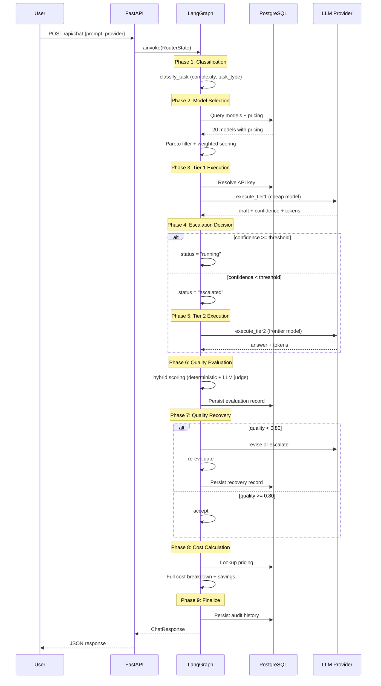

# Workflow Documentation

End-to-end execution sequence for the Cost-Aware Cascading LLM Router, covering every phase from request intake to response delivery.

---

## End-to-End Request Flow



---

## Phase 1: Request Intake & State Initialization

**Entry point:** `CascadingRouter.process_query(request: ChatRequest)`

The API handler receives a `ChatRequest` and initializes the 43-field `RouterState`:

```python
initial_state = {
    "request_id": f"qry_{uuid.uuid4().hex[:10]}",
    "tenant_id": "default",
    "user_id": request.user_id,
    "user_input": request.prompt,
    "provider": provider,                    # from request or auto-detect
    "confidence_threshold": threshold,       # from request or settings default
    "force_escalation": request.force_escalation or False,
    "force_tier1_only": request.force_tier1_only or False,
    "status": "running",
    # ... all other fields initialized to defaults
}
```

The graph is compiled with a PostgreSQL-backed `AsyncPostgresSaver` checkpointer, enabling durable state persistence and time-travel debugging.

---

## Phase 2: Task Classification

**Node:** `classify_task` | **File:** `agent/nodes.py:21`

Analyzes the user prompt to determine task type and complexity.

### Classification Logic

1. **Keyword scoring**: Scans for high-complexity keywords (`design`, `architect`, `distributed`, etc.) and medium-complexity keywords (`how does`, `why`, `implement`, etc.)
2. **Tool detection**: Checks for tool-related keywords (`search`, `lookup`, `calculate`, `api`, etc.)
3. **Structural signals**: Counts question marks, word count, code blocks
4. **Task type assignment**: Based on complexity score and keyword matches

### Output

| Field | Example Value | Description |
|---|---|---|
| `task_type` | `"qa"` | One of: qa, coding, analysis, comparison |
| `complexity_score` | `0.68` | Heuristic score 0.0-1.0 |
| `requires_tools` | `False` | Whether tools/API calls are needed |

---

## Phase 3: Model Selection

**Node:** `select_models` | **File:** `agent/nodes.py:91`

Queries the database for all available models and runs Pareto-optimal selection.

### Steps

1. **DB query**: Fetch all active `LLMModel` + `ModelPricing` rows
2. **Build candidates**: For each model, construct `ModelCandidate` with:
   - `quality` = `base_quality_score` from DB
   - `latency_ms` = `expected_latency_ms` from DB
   - `cost_per_million` = `0.75 * input_price + 0.25 * output_price`
3. **Filter by API key**: Only models whose provider has an available key (user DB or server env)
4. **Provider filter**: If specific provider requested, filter to that provider's models
5. **Pareto filter**: Remove dominated models (A dominates B if A >= B in all dimensions and > in at least one)
6. **Weighted scoring**: `score = 0.45 * quality_norm + 0.30 * latency_norm + 0.25 * (1 - cost_norm)`
7. **Select best**: Pick highest scoring model

### Output

| Field | Description |
|---|---|
| `candidate_models` | All models from DB |
| `eligible_models` | Models with active API keys |
| `pareto_models` | Non-dominated set with scores |
| `selected_model` | Best model_id |
| `routing_score` | Composite score |
| `routing_factors` | Selection context (provider, task_type, complexity) |

---

## Phase 4: Tier 1 Execution

**Node:** `execute_tier1` | **File:** `agent/nodes.py:166`

Calls the fast/cheap Tier 1 model and extracts a confidence score.

### Steps

1. **Resolve API key**: Priority chain: User DB key > Server env key > None
2. **Select model**: Use Pareto-selected model or provider default
3. **Call LLM**: Execute via provider-specific HTTP client
4. **Parse response**: Extract draft answer, confidence score, uncertainty reasons
5. **Calculate cost**: Look up pricing, compute `(input/1M)*rate + (output/1M)*rate`
6. **Record trace**: Append execution trace to `traces` list

### Provider Fallback Chain

```
Gemini -> Groq -> OpenAI -> Anthropic -> Mistral -> Mock
```

### Error Handling

| Error Type | Escalation Reason | Behavior |
|---|---|---|
| Timeout | `MODEL_TIMEOUT` | Escalate to Tier 2 |
| Rate limit (429) | `MODEL_RATE_LIMIT` | Escalate to Tier 2 |
| Other exception | `PROVIDER_ERROR` | Escalate to Tier 2 |

### Output

| Field | Description |
|---|---|
| `tier1_draft` | Model response text |
| `tier1_confidence` | Extracted confidence score (0.0-1.0) |
| `tier1_uncertainty_reasons` | List of uncertainty flags |
| `tier1_tokens` | `{input_tokens, output_tokens, total_tokens}` |
| `tier1_latency_ms` | Response time in milliseconds |
| `tier1_model_id` | DB model ID used |
| `tier1_model_name` | Display name |
| `traces` | Updated execution trace list |
| `actual_cost` | Running cost accumulator |

---

## Phase 5: Escalation Decision

**Node:** `decide_escalation` | **File:** `agent/nodes.py:247`

Compares confidence against threshold to decide whether to escalate.

### Decision Tree

```
1. force_escalation == True?
   -> YES: escalation_reason = FORCED_OVERRIDE, status = "escalated"

2. force_tier1_only == True?
   -> YES: escalation_reason = None, status = "running"

3. escalation_reason already set? (from execute_tier1 error)
   -> YES: status = "escalated" (preserve existing reason)

4. tier1_confidence < threshold?
   -> YES: escalation_reason = LOW_CONFIDENCE, status = "escalated"

5. Otherwise:
   -> escalation_reason = None, status = "running"
```

### Conditional Edge

```python
# agent/edges.py
def route_after_decision(state):
    if state["status"] == "escalated":
        return "escalate"   # -> execute_tier2
    return "direct"          # -> evaluate_quality
```

---

## Phase 6: Tier 2 Execution (Conditional)

**Node:** `execute_tier2` | **File:** `agent/nodes.py:286` | **Only if escalated**

Calls the frontier Tier 2 model with full escalation context.

### Input Context Passed to Tier 2

```
Original prompt: {user_input}
Tier 1 draft: {tier1_draft}
Escalation reason: {escalation_reason}
Uncertainty flags: {tier1_uncertainty_reasons}
```

### Steps

1. **Resolve API key** for Tier 2 provider
2. **Call frontier model** with escalation context
3. **Calculate cost** (typically 10-50x more expensive than Tier 1)
4. **Record trace** with Tier 2 execution details
5. **Set final_response** to Tier 2 answer

### Output

| Field | Description |
|---|---|
| `tier2_answer` | Frontier model response |
| `tier2_tokens` | Token usage |
| `tier2_latency_ms` | Response time |
| `tier2_model_id` | DB model ID |
| `tier2_model_name` | Display name |
| `final_response` | Updated to Tier 2 answer |
| `traces` | Updated trace list |
| `actual_cost` | Running cost accumulator |

---

## Phase 7: Quality Evaluation

**Node:** `evaluate_quality` | **File:** `agent/nodes.py:370`

Runs hybrid quality scoring on the final response.

### Evaluation Flow

```
evaluate_quality(prompt, response, model_id, query_id)
    |
    +---> classify_task(prompt) -> TaskType
    |
    +---> [by task type]
    |       classification -> evaluate_classification(response)
    |       extraction     -> evaluate_extraction(response)
    |       summarization  -> evaluate_summarization(response, source)
    |       qa             -> evaluate_classification(response) + evaluate_qa(prompt, response)
    |       tool_calling   -> evaluate_tool_calling(prompt, response)
    |
    +---> Blend scores
    |       Both available: 0.6 * deterministic + 0.4 * judge
    |       One available:  use that score
    |       Neither:        default 0.75
    |
    +---> Clamp to [0.0, 1.0]
    |
    +---> Persist to model_quality_evaluations table
```

### Quality Gate

| Score | Action |
|---|---|
| `>= 0.90` | Accept (proceed to cost calculation) |
| `0.80 - 0.89` | Mark for revision (handled by recover_quality) |
| `< 0.80` | Mark for escalation (handled by recover_quality) |

### Output

| Field | Description |
|---|---|
| `quality_score` | Composite quality score |
| `evaluation` | Full evaluation result dict |
| `escalation_reason` | Set to `LOW_QUALITY` if score < revise threshold |
| `status` | Set to `"escalated"` if quality is low |

---

## Phase 8: Quality Recovery

**Node:** `recover_quality` | **File:** `agent/nodes.py:432`

Attempts to improve low-quality responses via revision or escalation.

### Recovery Decision

```
decide_action(quality_score, tier):
    score >= 0.90  -> ACCEPT
    score >= 0.80  -> REVISE (if tier1) or ACCEPT (if tier2)
    score < 0.80   -> ESCALATE (if tier1) or ACCEPT (if tier2)
```

### Revision Flow

1. **Build revision prompt** with quality metrics feedback:
   ```
   The following response was evaluated on quality dimensions:
   - Relevance: 0.72/1.0
   - Accuracy: 0.65/1.0
   - Faithfulness: 0.80/1.0

   Please revise to improve the weakest dimensions.

   Original question: {prompt}
   Current response: {current_answer}
   ```
2. **Re-run same model** with revision prompt
3. **Re-evaluate** the revised response
4. **Check if revised score** reaches accept threshold
5. If yes: return `revise_success`
6. If no: return `revise_failed`

### Escalation Flow (Tier 1 Only)

1. Call `execute_tier2` with the current answer as context
2. Re-evaluate the escalated response
3. Return `escalate` with the new answer

### Recovery Outcomes

| `action_taken` | Meaning |
|---|---|
| `accept` | Quality was sufficient, no action needed |
| `revise_success` | Revision improved quality above threshold |
| `revise_failed` | Revision attempts exhausted without improvement |
| `escalate` | Escalated to stronger model |
| `tier2_best_available` | Already on Tier 2, accepted as best available |

### Output

| Field | Description |
|---|---|
| `final_response` | Updated if revised or escalated |
| `traces` | New trace appended for recovery action |
| `actual_cost` | Updated with recovery cost |
| `quality_recovery` | Recovery result dict |
| `escalation_reason` | Set to `QUALITY_REVISION_FAILED` if revision failed |

---

## Phase 9: Cost Calculation

**Node:** `compute_costs` | **File:** `agent/nodes.py:536`

Computes full cost breakdown with savings analysis.

### Cost Calculation Steps

1. **Build TokenMetrics** from raw token dicts
2. **Build EscalationEvent** with reason and confidence
3. **Call CostTracker.calculate_cost_breakdown()**:
   - `tier1_cost`: (input/1M) * input_rate + (output/1M) * output_rate
   - `tier2_cost`: Same formula for Tier 2 (0 if not escalated)
   - `total_cost`: tier1 + tier2 + recovery costs
   - `baseline_cost`: What it would cost if everything went to Tier 2
   - `savings`: baseline - total
   - `savings_percent`: (savings / baseline) * 100

### Spend Justification

Auto-generated human-readable explanation:

- **If escalated**: "Extra spend incurred: Tier 1 confidence was 0.61 (below threshold 0.75). Escalated to Tier 2 with reason 'low_confidence' to guarantee answer accuracy."
- **If direct**: "Cost-effective routing: Tier 1 confidence was 0.94 (above threshold 0.75). No escalation needed, saving $X.XX vs Tier 2 baseline."

---

## Phase 10: Finalize & Persist

**Node:** `finalize` | **File:** `agent/nodes.py:593`

Assembles the final response and persists audit history.

### Steps

1. **Determine serving tier**: `"tier2"` if escalated and tier2 answered, else `"tier1"`
2. **Build QueryHistoryItem** with all metadata
3. **Persist to history store** (JSON file + in-memory cache)
4. **Return status**: `"completed"` if response exists, `"failed"` otherwise

### Response Assembly

The `CascadingRouter._assemble_response()` function converts the final LangGraph state into a `ChatResponse`:

```python
ChatResponse(
    id=state["request_id"],
    prompt=state["user_input"],
    final_answer=state["final_response"],
    served_by_tier="tier1" or "tier2",
    served_by_model="Claude 3.5 Haiku (Simulated)",
    confidence=state["tier1_confidence"],
    escalation=EscalationEvent(
        escalated=True/False,
        reason="LOW_CONFIDENCE" | None,
        explanation="Confidence 0.61 is below threshold 0.75...",
        trigger_confidence=0.61,
        threshold=0.75,
    ),
    traces=[ModelExecutionTrace, ...],
    cost_breakdown=CostBreakdown(...),
    total_latency_ms=245.67,
    quality_evaluation=QualityEvaluationResult(...),
    quality_recovery=QualityRecoveryResult(...),
    timestamp=datetime.now(timezone.utc),
)
```

---

## Example Scenarios

### Scenario 1: Direct Tier 1 (Simple Query)

```
Input: "What is the capital of France?"

1. classify_task: complexity=0.05, task_type="qa"
2. select_models: Pareto picks Gemini Flash (cheapest)
3. execute_tier1: draft="Paris", confidence=0.97
4. decide_escalation: 0.97 >= 0.75 -> "running"
5. evaluate_quality: score=0.92 (high relevance + accuracy)
6. recover_quality: 0.92 >= 0.90 -> accept
7. compute_costs: tier1=$0.00001, baseline=$0.0003, savings=96.7%
8. finalize: served_by_tier="tier1"

Output: "Paris" at 1/30th the cost of Tier 2
```

### Scenario 2: Escalation to Tier 2 (Complex Query)

```
Input: "Explain the trade-offs between CPAP and Raft consensus protocols"

1. classify_task: complexity=0.72, task_type="analysis"
2. select_models: Pareto picks Llama 3.1 8B (Tier 1)
3. execute_tier1: draft="Basic comparison...", confidence=0.61
4. decide_escalation: 0.61 < 0.75 -> "escalated" (LOW_CONFIDENCE)
5. execute_tier2: Llama 3.3 70B with escalation context
6. evaluate_quality: score=0.88
7. recover_quality: 0.88 >= 0.80 -> accept (but < 0.90, would revise if tier1)
8. compute_costs: tier1=$0.0001, tier2=$0.002, total=$0.0021
9. finalize: served_by_tier="tier2"

Output: Comprehensive analysis at justified cost
```

### Scenario 3: Quality Recovery (Marginal Quality)

```
Input: "Summarize this technical document"

1. classify_task: task_type="summarization"
2. execute_tier1: draft="Brief summary...", confidence=0.82
3. decide_escalation: 0.82 >= 0.75 -> "running"
4. evaluate_quality: score=0.78 (below revise threshold)
5. recover_quality: 0.78 < 0.80 -> escalate to Tier 2
6. execute_tier2: Better model produces improved summary
7. re-evaluate: score=0.91
8. compute_costs: tier1 + tier2 + recovery costs tracked

Output: High-quality summary with full recovery audit trail
```

---

## State Persistence

### LangGraph Checkpointer

Every graph invocation is checkpointed to PostgreSQL via `AsyncPostgresSaver`:

- **Thread ID**: `query_id` (e.g., `qry_74f2e1b11e`)
- **State snapshots**: Stored after each node execution
- **Time-travel**: Can replay from any checkpoint
- **Fallback**: `MemorySaver` if PostgreSQL checkpointer unavailable

### Audit History

The `finalize` node persists a `QueryHistoryItem` to the history store:

```json
{
    "id": "qry_74f2e1b11e",
    "timestamp": "2026-09-16 04:20:54 UTC",
    "prompt": "What is the capital of France?",
    "final_answer": "Paris",
    "provider": "mock",
    "served_by_model": "Claude 3.5 Haiku (Simulated)",
    "served_by_tier": "tier1",
    "confidence": 0.97,
    "escalated": false,
    "escalation_reason": null,
    "total_tokens": 204,
    "total_cost_usd": 0.000326,
    "savings_usd": 0.001213,
    "spend_justification": "Cost-effective routing: Tier 1 handled query directly."
}
```
